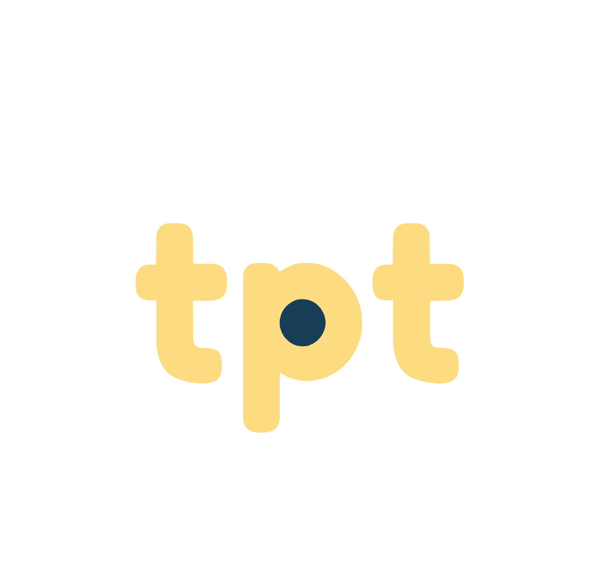
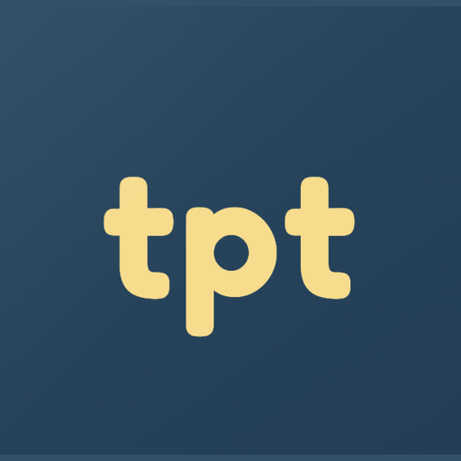

# Identité visuelle — TempsPourTemps

<p align="center">
  
</p>

> **Espace documentaire centralisé** de l'identité visuelle de TempsPourTemps (TpT), plateforme d'échange de temps et d'entraide entre voisins.
> Rédigé le 2026-06-10. À considérer comme la **source de vérité** pour toute production visuelle (app, landing, emails, print, réseaux sociaux).

---

## En bref

| | |
|---|---|
| **Nom** | TempsPourTemps (TpT) |
| **Promesse** | « Échangez du temps, pas de l'argent » |
| **Mission** | Reconnecter le voisinage par l'entraide concrète |
| **Personnalité** | Voisin·e bienveillant·e + animateur·rice de quartier |
| **Couleurs signatures** | Marine `#183e57` · Orange brûlée `#d65e1c` · Jaune sable `#fcdb81` |
| **Typographies** | Nunito Rounded (titres, wordmark) + Inter (texte courant) |
| **Maturité actuelle** | Identité fonctionnelle mais provisoire — voir [audit critique](./07-audit-critique/audit-critique-roadmap.md) |

---

## 🎨 Aperçu visuel

### Logo

| Variante | Aperçu | Usage |
|---|:---:|---|
| **Sur fond marine** (principal) |  | Tous fonds clairs ou photos chargées |
| **Transparent** |  | Fonds marine ou très foncés maîtrisés |
| **Icône PWA** |  | App stores, écrans d'accueil mobile |

**Monogramme** « **tpt** » en jaune sable sur carré marine. Détail signature : le **cercle marine au centre du `p`** qui crée le contre-poinçon — c'est lui qui rend le logo reconnaissable au format favicon (16×16).

→ Détails, règles d'usage et variantes manquantes dans **[02 · Logo](./02-logo/logo.md)**.

---

### Palette de couleurs

#### Signature (3 couleurs)

| Aperçu | Nom | Hex | RGB | Usage |
|:---:|---|---|---|---|
|  | **Marine** | `#183e57` | `24, 62, 87` | Ancrage, texte courant, top bar, boutons primaires |
|  | **Orange brûlée** | `#d65e1c` | `214, 94, 28` | Accents dynamiques, highlights, énergie ponctuelle |
|  | **Jaune sable** | `#fcdb81` | `252, 219, 129` | Texte sur marine, focus ring, lumière, optimisme |

#### Sémantique (4 couleurs fonctionnelles)

| Aperçu | Nom | Hex | Usage |
|:---:|---|---|---|
|  | **Success** | `#4a9d5f` | Validations, confirmations, créditation |
|  | **Danger** | `#c44536` | Erreurs, suppression, refus |
|  | **Warning** | `#d97706` | Alertes, expirations imminentes |
|  | **Info** | `#183e57` | Messages neutres (= marine signature) |

#### Fonds, textes, bordures

| Aperçu | Nom | Hex | Usage |
|:---:|---|---|---|
|  | **Bg main** | `#f7f6f3` | Fond principal app (crème chaud) |
|  | **Bg secondary** | `#f3f3f5` | Cards secondaires, inputs |
|  | **Bg hover** | `#fdf1d7` | Survol (sable très clair) |
|  | **Text secondary** | `#4b5563` | Texte gris ardoise (paragraphes secondaires) |
|  | **Text tertiary** | `#717182` | Mentions légales, métadonnées |
|  | **Border** | `#d6dbe2` | Bordure marquée (cards, inputs) |

#### Gradient signature (hero)


```css
background: linear-gradient(180deg, #fff9ec 0%, #fff3e0 32%, #f3f7fb 100%);
```

→ Tokens CSS complets, accessibilité, divergences inter-supports dans **[03 · Palette de couleurs](./03-couleurs/palette-couleurs.md)**.

---

### Typographies

| Police | Usage | Aperçu (style) | Source |
|---|---|---|---|
| **Nunito Rounded** | Titres, wordmark, accroches | Sans-serif géométrique, **terminaisons arrondies**, weights 700 / 800 | Google Fonts (⚠️ licence à vérifier — voir 04) |
| **Inter** | Corps de texte, UI, labels | Sans-serif neutre conçue pour l'écran, weights 400 / 500 / 600 / 700 | [rsms.me/inter](https://rsms.me/inter) · SIL OFL |

#### Hiérarchie type

```
Display XL    Nunito Rounded 800   56px desktop · 36px mobile   (héros landing)
H1            Nunito Rounded 800   40px desktop · 28px mobile   (titre de page)
H2            Nunito Rounded 700   28px desktop · 22px mobile   (titre de section)
H3            Nunito Rounded 700   20px desktop · 18px mobile   (titre de card)
Body L        Inter          400   18px                          (intros)
Body          Inter          400   16px                          (texte courant)
Body S        Inter          400   14px                          (métadonnées)
Caption       Inter          400   12px                          (mentions légales)
```

→ Règles, anti-patterns, alerte licence Nunito Rounded dans **[04 · Typographie](./04-typographie/typographie.md)**.

---

### Tokens prêts à copier-coller

#### CSS variables

```css
:root {
  /* Signature */
  --color-primary: #183e57;          /* marine */
  --color-primary-hover: #0f2f44;
  --color-secondary: #d65e1c;        /* orange brûlée */
  --color-accent: #fcdb81;           /* jaune sable */

  /* Fonds */
  --color-bg-main: #f7f6f3;
  --color-bg-secondary: #f3f3f5;
  --color-bg-hover: #fdf1d7;

  /* Textes */
  --color-text-main: #183e57;
  --color-text-secondary: #4b5563;
  --color-text-tertiary: #717182;

  /* Bordures */
  --color-border-main: #e9ebef;
  --color-border-secondary: #d6dbe2;

  /* Sémantique */
  --color-success: #4a9d5f;
  --color-danger:  #c44536;
  --color-warning: #d97706;
  --color-info:    #183e57;

  /* Focus */
  --color-focus: #fcdb81;

  /* Typo */
  --brand-font: 'Nunito Rounded', 'SF Pro Rounded', 'Avenir Next Rounded',
                'Quicksand', 'Poppins', Inter, system-ui, sans-serif;
  --body-font:  Inter, 'SF Pro Display', 'Segoe UI', system-ui, sans-serif;
}
```

#### Tailwind config (extrait)

```js
theme: {
  extend: {
    colors: {
      primary:   { DEFAULT: '#183e57', hover: '#0f2f44' },
      secondary: { DEFAULT: '#d65e1c', hover: '#b84e17' },
      accent:    { DEFAULT: '#fcdb81', hover: '#f5cb5c' },
      success:   '#4a9d5f',
      danger:    '#c44536',
      warning:   '#d97706',
    },
    fontFamily: {
      brand: ['Nunito Rounded', 'system-ui', 'sans-serif'],
      body:  ['Inter', 'system-ui', 'sans-serif'],
    },
  },
}
```

#### Print (équivalents CMJN approximatifs)

```
Marine   #183e57   →  C85 M65 J40 N40
Orange   #d65e1c   →  C0  M75 J95 N5
Sable    #fcdb81   →  C0  M15 J55 N0
```

⚠️ À valider avec l'imprimeur sur épreuve papier (les CMJN rendent différemment selon papier et machine).

---

## Sommaire de l'espace documentaire

### 📐 Fondations (le « pourquoi »)
- **[01 · Stratégie de marque](./01-strategie/strategie-de-marque.md)** — mission, valeurs, cible, personnalité, ton, promesse
- **[07 · Audit critique & roadmap](./07-audit-critique/audit-critique-roadmap.md)** — état des lieux honnête, benchmark concurrentiel, recommandations priorisées, scénarios DIY / freelance / agence

### 🎨 Éléments graphiques (le « quoi »)
- **[02 · Logo](./02-logo/logo.md)** — description, variantes, règles d'usage, exclusion zone
- **[03 · Palette de couleurs](./03-couleurs/palette-couleurs.md)** — tokens, sémantique, accessibilité, usages
- **[04 · Typographie](./04-typographie/typographie.md)** — Nunito Rounded + Inter, hiérarchie, licences
- **[05 · Univers visuel](./05-univers-visuel/univers-visuel.md)** — illustrations, pictos, photos, mood

### 🧱 Déclinaisons (le « où »)
- **[06 · Supports & déclinaisons](./06-supports/declinaisons-supports.md)** — web/app, print, réseaux sociaux, emails
  - **[Template email canonique](./06-supports/emails/README.md)** — extraction et règles à partir de l'email du 17 juin

### 📎 Assets bruts
- **[`assets/logo/`](./assets/logo/)** — PNG (avec / sans fond), SVG, favicon, icône PWA
- **`assets/references/`** — références externes locales (non versionnées)

---

## Comment utiliser ce dossier

1. **Avant toute nouvelle production visuelle** (post LinkedIn, flyer mairie, mockup, nouvelle page) : commencer par la stratégie de marque (01) pour vérifier l'alignement avec la mission/personnalité.
2. **Pour une question technique précise** (« quelle couleur pour un bouton danger ? », « quel weight pour un titre de section ? ») : aller directement dans le doc concerné (02 à 06).
3. **Si on hésite sur la conformité de quelque chose** : se référer à l'audit (07) qui répertorie les écarts connus entre app, landing et emails — et l'arbitrage à faire.
4. **Quand on modifie un élément du design system** (palette, typo, logo) : mettre à jour le doc correspondant **et** consigner la décision dans la section « Historique » du doc concerné.

---

## Cycle de vie de ce document

Ce dossier est **vivant**. Il sera enrichi à chaque grande étape :
- **Phase actuelle** : audit et formalisation de l'existant (juin 2026)
- **Phase suivante** : décisions stratégiques (challenger palette ? embaucher un freelance ? cf. roadmap dans 07)
- **Phase d'industrialisation** : production de templates print + RS + nouveau logo si décidé

**Dernière mise à jour** : 2026-06-10

---

## Méthode et sources

Ce document s'appuie sur le framework « identité visuelle » d'un support de formation tiers (non versionné dans ce dépôt pour raisons de droits) (les 6 éléments constitutifs, les 6 étapes de création, les 3 critères de pérennité : multiplateforme / déclinable / évolutif).

Les analyses techniques de l'existant se basent sur :
- `app/assets/css/main.css` du repo `tempspourtemps-stseb` (design system app)
- `src/app/globals.css` du repo `tempspourtemps-landing` (landing)
- `~/Downloads/email_cloture_17juin.html` (template email best-effort actuel)
- Assets bruts dans `public/` du repo de l'app

---

<p align="center">
  <sub>Les nuanciers de couleurs ci-dessus sont générés via <a href="https://placehold.co">placehold.co</a> (service public, gratuit, sans tracking).</sub>
</p>
